# Gen6CTRPluginFrameworkOverhauled — v0.8.0

**English** · [Português](README.pt-BR.md)

[](https://ko-fi.com/E5N7227AO5)

A friendly box of superpowers for **Pokémon X, Y, Omega Ruby and Alpha Sapphire** on the Nintendo 3DS.

## What is this?

It's a `.3gx` plugin you drop onto your 3DS that adds a menu over your Pokémon game — spawn any Pokémon, shop
anywhere, edit your team, read your rival mid-battle, play a few mini-games, and a hundred small comforts in between.

The twist: **it was built to be understood.** Every feature is named in plain language, every option has an info
button that explains it, and there's a 23-page guide *inside* the plugin that walks you through it all. The menus
are available in **7 languages**. If you love these games but have never touched homebrew, you're exactly who this
is for.

You open everything with **SELECT**, and the menu appears over your game:

<p align="center">
  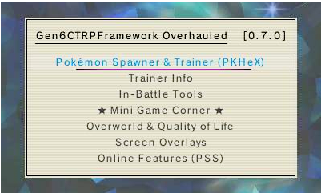
</p>

> 🎯 **Works on all four Gen 6 games.** X, Y, Omega Ruby and Alpha Sapphire each get their own tailored content (guides + assets) in their own Title-ID folder, and the same `.3gx` auto-detects which game you're running.

> 🌐 **Available in 7 languages**, switchable in-plugin: 🇺🇸 English · 🇫🇷 French · 🇩🇪 German · 🇮🇹 Italian · 🇯🇵 Japanese · 🇧🇷 Portuguese (Brazil) · 🇪🇸 Spanish.

## Made by a curious player, with Claude

I'll be upfront: **I'm not a programmer.** I'm a curious player — someone who's good at testing, poking at things,
and thinking hard about a problem and how it might be solved. Every feature here was built in back-and-forth
("bate-bola") with Claude, and I'm not the least bit shy about saying so: that collaboration is exactly what let me
*materialize* the things I kept wishing existed while I played.

Because that's where all of this came from — **real needs, discovered while playing.** I'd be deep in a run, hit
some friction, and think "there should be a way to…", and then we'd go build it. Bit by bit I poured a little of my
own personality into each feature as it took shape. **Parabéns aos criadores** of everything this stands on —
standing on the shoulders of giants is no exaggeration here (see [Credits](#-credits)).

## A guided tour

Here's the plugin roughly in the order you'd meet it. Nothing below is required reading — it's just a friendly
walk through the rooms.

### It starts with one button

Press **SELECT** and the menu opens over your game. Move with the **D-Pad**, choose with **A**, go back with **B**.
The bottom touch screen holds the big buttons — **Favorites**, **Search**, the **Game Guide** and **App Guide**,
**ActionReplay** and **Tools**. Highlight anything and press **X** for its info note, or **Y** to pin it to
Favorites. That's the whole language of the menu.

### Spawn and catch any Pokémon

The **Wild Pokémon Spawner** is a live, filtered list of every species. The top screen shows the matches; the
bottom screen is a filter hub — narrow by name, Dex number, generation, type or what you already own.

<p align="center">
  
  
</p>

Open any result for a full sheet — sprite, types, abilities (including the Hidden one), base stats and the four
moves it knows at your level — then set form, level and Normal/Shiny and spawn it into the grass.

<p align="center">
  
  
</p>

Knocked out a legendary, or watched one flee? **Respawn Legendary** lists them all with their real locations and
sends the one you pick back where you found it.

### Hunt shinies with the Radar

**X/Y only.** The **Shiny Hunt Companion** counts your wild encounters of a target species, alerts and pauses on
a real shiny, and — reorganised in v0.8.0 — splits into three tabs you flip with **L/R**: **Hunt**, **PokeRadar**
and **Chain**.

<p align="center">
  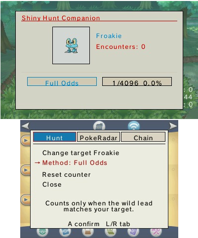
  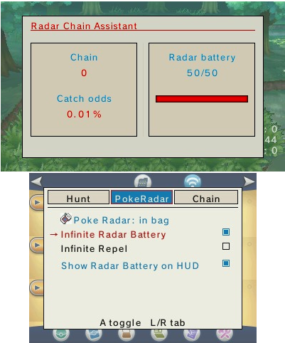
  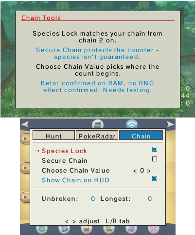
</p>

The **Chain** tab is the new heart of it. **Species Lock (beta)** forces the species you're chaining onto every
grass patch in the area from chain 2 on, so you only have to avoid the empty ones — species and form are set,
while level, IVs and nature stay natural. **Secure Chain (beta)** keeps the Poké Radar chain counter from
resetting, and **Choose Chain Value** lets you set the starting count. Pair them with **Infinite Repel** and
**Infinite Radar Battery** for uninterrupted chaining, and read the live chain and shiny odds right on the HUD.

<p align="center">
  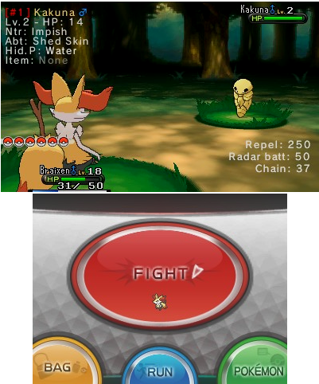
</p>

> 🧪 Species Lock and Secure Chain are **beta** — confirmed to act on the game's RAM, but their effect on the
> game's own shiny RNG is still being tested. Give them a try and report what you see.

### Carry a Poké Mart in your bag

**PokéMart Anywhere** turns the item-adder into a real shop. Choose a mode: **FREE** adds anything, any amount, for
nothing — or **PAY**, a real Poké Mart where the list narrows to what you can actually buy and each item costs your
money.

<p align="center">
  
  
</p>

Buy on the spot, or build a **cart** and review it all at **Checkout** before you pay — you can never overspend.
And sort the whole list by name, price, type or how many you own.

<p align="center">
  
</p>

### Build and rebuild in your boxes

**PC Box ++** is your storage shown as a grid of sprites, just like the in-game PC. Move around with the D-Pad,
change box with L/R, and **move (X)**, **clone (Y)** or **search (START)** right on the grid.

<p align="center">
  
  
</p>

Press **A** to open the editor, where the details split into tabs — Main, Stats, Moves, Origins, Misc. Every field
(species, IVs/EVs, moves, ability, held item, ball and more) is picked from a tidy on-screen list — no typing, no
keyboard.

<p align="center">
  
</p>

The same editor now reaches your **Party**, not just the PC boxes — three tabs across the top switch between **PC
Box**, **Party** (your six, as big sprites) and **Swap**. Open any party Pokémon and you get the exact same tabbed
editor as the boxes — Main, Stats, Moves, Origins, Misc — and editing it really changes it in-game and sticks
after you save.

<p align="center">
  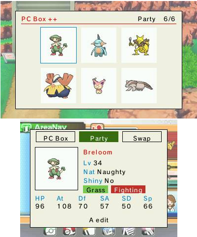
  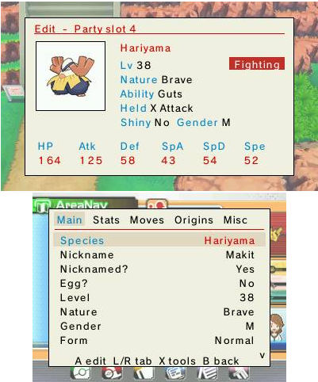
</p>

**Swap** is a two-step exchange: pick a Pokémon, then pick who it trades places with — Box↔Party or the other way
around. The whole window turns purple while you're in Swap so you never forget which mode you're in.

<p align="center">
  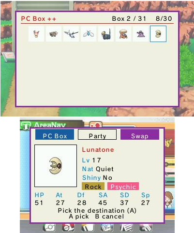
</p>

### Know your team at a glance

**View Party Summary** lays your team out as cards with the real, hidden numbers — stats, IVs, EVs, nature,
ability, item and moves. Slide a selector over a stat and press **A** to jump to the teammate with the highest (or
lowest) value; little ▲/▼ marks flag your team's best and worst.

<p align="center">
  
</p>

**Team Coverage** lists your whole party's types at a glance, then breaks down the real synergy: which attack
types threaten two or more teammates at once, who takes a full 4x hit from something, and which types your own
moves can't get through — read as plain sentences, not a stat table.

<p align="center">
  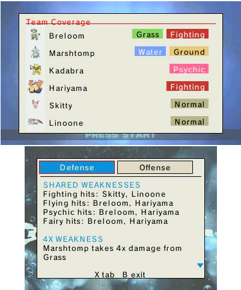
</p>

**Nature / IV / EV Advisor** is three checks in one screen (L/R switches): **Nature** flags a nature that
lowers the stat a Pokémon actually attacks with (or Speed, which matters either way), **IV** flags low IVs in
the stats it actually relies on, and **EV** flags EV investment that doesn't match its actual known moves —
EVs in Sp. Atk on something with only Physical moves, say. **Held Item Advisor** shows what your team is
currently holding and suggests one for anybody empty-handed, split between what you already own (**In Bag**)
and what you'd need to pick up (**To Get**, with a Suggested Cart button straight into PokéMart Anywhere).

<p align="center">
  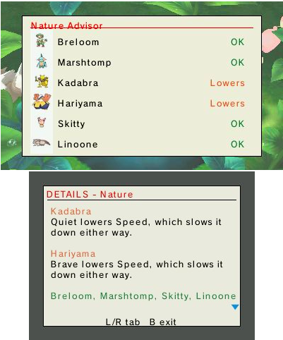
  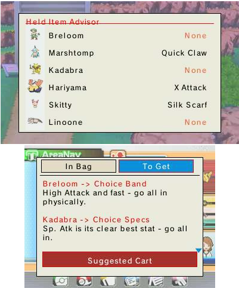
</p>

**Breeding Compatibility** (in the Breeding folder) checks Day Care pairs for you: **Party** and **Boxes** scan
what you already own for compatible pairs (shares an egg group, or either side is Ditto) and show the egg
moves the baby could inherit from a parent's current moveset, sorted so the useful ones surface first — with
a filter by egg group (**Y**) when the list gets long. **Check Two** lets you test any two species with the
visual Species Picker, even ones you don't own yet, showing both parents and what actually hatches side by
side.

<p align="center">
  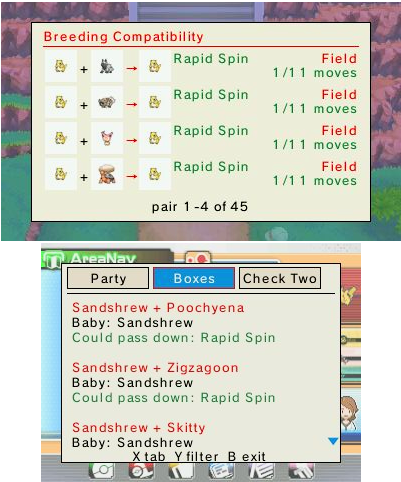
  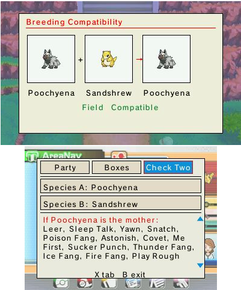
</p>

**Level Cap** is a nuzlocke/hardcore helper: it sets a level cap from the **next Gym Leader's ace** (read
live from your badges) plus an offset you pick, so it advances on its own as you earn badges — nothing to
re-enter between sessions. Your party is listed against the cap with anyone over it flagged; **D-Pad
Up/Down** browses the upcoming gyms to preview how your team compares further ahead. Switch between
**Warn** (just flag it) and **Enforce** (a one-tap button pulls over-cap Pokémon back down to the cap,
recalculating their stats), or turn it **Off** for the postgame — and a live HUD field can show the
over-cap count while you play.

<p align="center">
  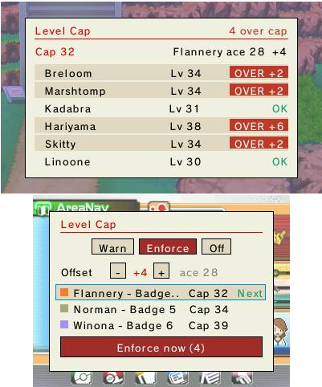
  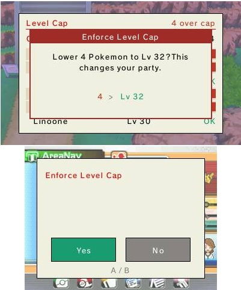
</p>

Enforce **applies and saves right away** (only level and stats drop); the number shown in your in-game party
menu refreshes after your next battle or a PC-box visit. For the live over-cap warning on the HUD, turn on
**Level cap** in Screen Overlays → Config HUD.

### Win the battle

The **In-Battle Tools** are the things you reach for mid-fight. **Enemy Helper** is a coach card for the foe — it
explains its ability, item and moves, lists the types that beat it, and compares its six stats against your active
Pokémon (and even tells you whether you already own the species). Its **Compare** tab opens straight into
**Damage Calc**: an estimated damage range and hits-to-KO for both sides' moves, each side's name and moves
colored to match so it's obvious at a glance who's who — press **Y** to switch back to the plain stat comparison.

<p align="center">
  
  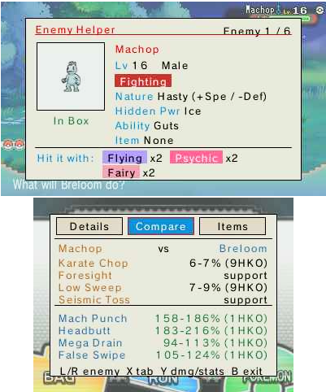
</p>

**Change Party Stats** is a visual editor for your own team, right in the middle of a fight — heal, fix HP/PP,
status, item, moves, or multiply EXP without ever leaving the battle. And **Display Enemy Stats** overlays the
opponent's hidden data on the top screen.

<p align="center">
  
  
</p>

### Take a break — the Mini Game Corner

When you want to just play, there's a little arcade of seven games. Pick one from the grid; the bottom screen has a
**FREE / PAY** switch (FREE keeps what you win, your money never changes; PAY puts real Pokédollars on the line).

<p align="center">
  
  
</p>

Open loot boxes, spin a prize wheel, pull the slots, bet on a stat duel, guess higher-or-lower, roll a wild
challenger into your next encounter, or generate a whole random team into an empty box.

<p align="center">
  
  
  
</p>

### Smooth the long journey

The **Overworld & Quality of Life** tools take the ache out of a long run — fast text, fast walk, teleport, walk
through walls, instant eggs and more. And a small, configurable **HUD** can keep your money, clock, map position
and lead's status right on screen while you play.

<p align="center">
  
  
</p>

### Travel anywhere

**Teleportation** can drop you at any town, route or landmark in Hoenn — and, with a little teaching, exactly where
*you* like to stand. Pick a destination, then **HOLD L** and step into any door to warp there. The bottom screen
sorts every place into tabs — **All**, **Towns**, **Other** (Caves / Forests / Landmarks / Mirage Spots, as
sub-menus), **Routes** (101–134) and **Map**. **A** teleports, **Y** flips between the picture grid and a plain list,
and **X** jumps the selection to wherever you're standing right now.

<p align="center">
  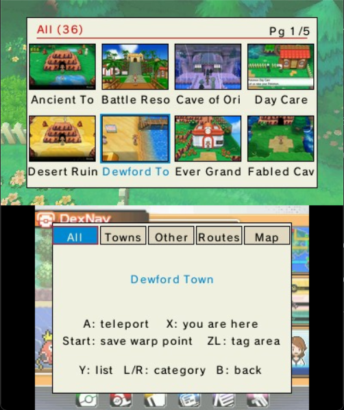
  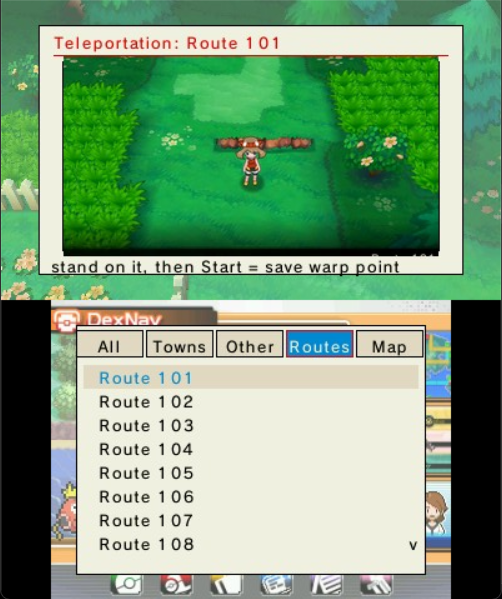
</p>

Two buttons make it your own: stand exactly where you want to arrive, then **Start = save warp point** (your precise
landing tile — this is also what makes a **route** teleportable) or **ZL = tag area** (teaches **X** the hidden
sub-maps it doesn't recognise yet). The **Map** tab is a living mini-map you *walk* with the D-Pad — town to route to
town, just like the real journey — and pressing **Y** there swaps it for a single picture-grid of *every* place
(towns + routes, no labels), laid out roughly like Hoenn and filterable by the chips along the bottom (tap more than
one). Everything you save lands in a hand-editable **MyTeleport.txt** in the plugin folder, and it survives updates.

<p align="center">
  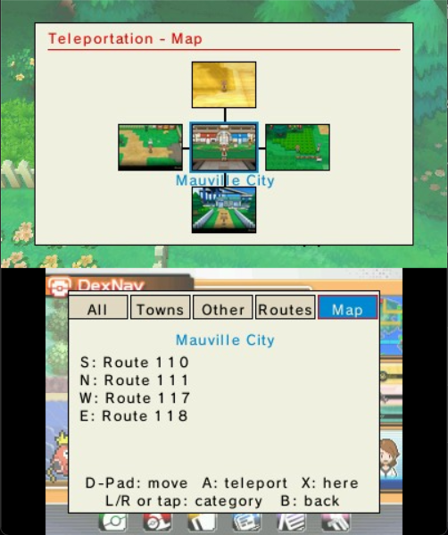
  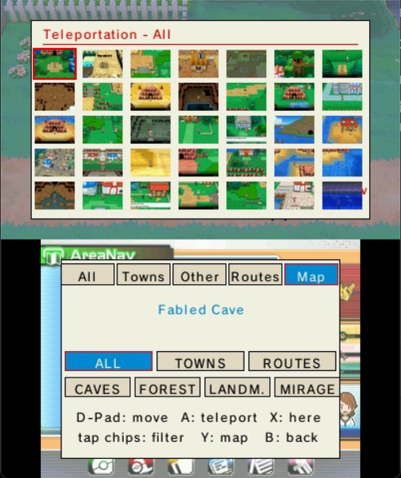
</p>

### Make it yours

Twenty-five color **themes** restyle the whole interface — menus, buttons, even the in-game keyboard — with a
preview swatch beside each name and your choice remembered between sessions. Pin your most-used features to
**Favorites** (two columns, drag to reorder), and rebind the menu keys in **Tools › Hotkeys**.

<p align="center">
  
  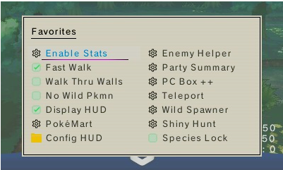
</p>

And if you ever feel lost, the **App Guide** (23 pages, written like a guided adventure rather than a manual) and an
**info (i) note on every single function** are always one button away.

## 📜 How it grew

A short history, newest last — no detail, just the shape of it:

- **v0.2.x** — the big UX overhaul: re-organised menus, Favorites, toasts, the HUD, and the first themes.
- **v0.3.0** — the dual-screen finders (Wild Pokémon Spawner, Respawn Legendary) and the App Guide.
- **v0.3.1** — **PokéMart Anywhere** (a real in-bag shop with prices, cart and checkout) + bag sorting.
- **v0.3.2** — capture the plugin's own UI in screenshots; favorites/cheats/hotkeys survive a plugin update.
- **v0.3.3** — **In-Battle Tools** (Enemy Helper, Change Party Stats), the visual **PC Box ++** editor, and the
  **Mini Game Corner**.
- **v0.4.2** — **Teleportation** reborn: a two-screen place picker with a navigable **Map** and a full picture-grid
  overview, your own saved **warp points** (the hand-editable `MyTeleport.txt`), and tidier plugin folders under
  **Assets/**.
- **v0.5.0** — **multi-game**: tailored content for all four Gen 6 titles (X, Y, Omega Ruby, Alpha Sapphire), a full Kalos teleport map, and the UI in **7 languages**.
- **v0.6.0** — the **O-Power Center**: a visual panel for all 18 O-Powers and the charge gauge (one-tap Refill, Max All, and a Keep toggle for no recharge wait).
- **v0.6.1** — **RNG Tracking**: read your game's RNG live on the HUD (TSV, current seed, frame, egg seed) for shiny hunting and RNG abuse — plus new HUD fields (held item, encounters, session steps), **Max DexNav Search Lv.**, **Health & Mana**, and **Language** moved into Tools.
- **v0.6.2** — **RNG Tracking++**: the on‑device **initial seed** is now captured live (so 3DSRNGTool can actually predict your shinies), **frame** is the true advance count, a **Target frame** countdown with a parity hint nails the timing, a **Freeze** toggle holds the whole HUD still to copy values down, the **TinyMT** wild‑encounter RNG (state + advances) shows in copy‑ready `[3][2]/[1][0]` form, plus **TRV** — all in a PokeReader‑style layout.
- **v0.6.3** — **HUD polish**: the misnamed "Clock" field is now **Time Played**, joined by two new HUD fields — **In-Game Time** (the game's day/night phase from the 3DS clock, e.g. `14:15 - Day`) and **Real Time** (the console clock) — and the **Party count** field now shows your true roster size.
- **v0.6.4** — **Hunter's Update**: a **Trainer Card** with your OT/TID, cash, Time Played, party sprites, and your **real gym badges read live from your save**; **Egg Peek** to reveal a masked egg's contents (`?`) without hatching it (and eggs made in PC Box ++ now get a real received date/place); and a **Shiny Hunt Companion** that counts your encounters of a target species and alerts + pauses on a real shiny.
- **v0.6.5** — **Living Dex Dashboard**: a read-only collection panel for all 721 species — owned, shiny, and missing — filterable by **Type**, **Gen** and **Category**, with an export to a `LivingDex.txt` missing list and a full species info card a tap away; plus a cleaner, more spacious **PC Box ++** grid.
- **v0.7.0** — **Champion's Update**: **Gym Coach** previews the next Gym Leader's, Elite Four member's, or Champion's team for the game you're playing — a type-matchup verdict against your own party, a full species card per Pokémon, and a **Suggested Cart** that opens PokéMart Anywhere already stocked for that specific fight.
- **v0.7.1** — **Damage Calc**: Enemy Helper's Compare tab now opens straight into an estimated damage range and hits-to-KO for both sides' moves, color-matched by owner so it's clear at a glance who deals what — press **Y** for the plain stat comparison.
- **v0.7.2** — **Gym Coach** now reads your real gym badges to jump straight to your next opponent the first time you open it each session, with a **Next** tag on the list so you always know who that is.
- **v0.7.3** — **Team Coverage**: a new Trainer Info screen listing your party's types at a glance, plus a Defense/Offense breakdown of shared weaknesses, 4x hits, and blind spots your own moves can't get through.
- **v0.7.4** — **EV Advisor** and **Held Item Advisor**, two more Trainer Info screens: one flags EV investment mismatched with your Pokémon's actual moves, the other suggests held items (split In Bag / To Get) — plus Team Coverage gained a third **Cart** tab for a general team-support shopping list.
- **v0.7.5** — EV Advisor grew into **Nature / IV / EV Advisor** (three checks, one screen), and a new **Breeding Compatibility** screen (Party / Boxes / Check Two) finds Day Care pairs, the egg moves they could pass down, and lets you test any two species before you even own both.
- **v0.7.6** — **PC Box ++** now edits your **Party**, not just the PC boxes (same visual editor), and gained a **Swap** tab to trade a Pokémon between Box and Party in two taps. Under the hood this fixes party editing for real — changes to party Pokémon now actually take effect in-game and persist to the save.
- **v0.7.7** — **Level Cap**, a new Trainer Info screen for nuzlocke/hardcore runs: an auto level cap tied to the next Gym Leader's ace (+ your own offset), Warn or Enforce modes, a D-Pad browser to preview upcoming gyms, and a live HUD field for the over-cap count.
- **v0.7.8** — **Poké Radar: Infinite Battery** (X/Y) — keep the Radar's battery full in the overworld so there's no ~50-step recharge wait between chains, plus a live HUD battery readout. The **Poké Radar** also returns to the PokéMart Anywhere list on X/Y. Polish: Display Enemy Stats now remembers which fields you turned on, Encounters & Catching leads with Shiny Hunt Companion, and Favorites labels are cleaner. Suggested by u/Victhordiz.
- **v0.7.9** — a polish pass. **Shiny Hunt Companion & Radar Chain** got a cleaner look (theme-matched colors, no boxes around rows, a moving arrow for the cursor, and fixed-width odds chips). **Party Stats Summary** now shows each move's description — press **Y** to cycle through the four. **Config HUD** gained **All ON / All OFF** buttons for the RNG Tracking fields and an **L/R** shortcut to jump between Money, All ON and the Panel toggle, and the **Favorites** list keeps its two-column layout throughout.
- **v0.8.0** — **Radar Chain Update** (X/Y). The **Shiny Hunt Companion** splits into **Hunt / PokeRadar / Chain** tabs (L/R to switch), and the Chain tab adds two experimental helpers: **Species Lock**, which forces the species you're chaining onto every grass patch in the area from chain 2 on (species + form only — level, IVs and nature stay natural), and **Secure Chain**, which keeps the chain counter from resetting. Plus **Choose Chain Value** to set the starting count, an **uncapped chain readout** (the real number past 40, not "40+"), **Infinite Repel** (renamed from Repel Auto-Refresh), a **Transparent Notifications** toggle for box-free toasts, a **"Changed" scan type** in Search, and a batch of text fixes. Species Lock & Secure Chain are beta — report your results.

## 📥 Installing

> 💻 **Also works on the Azahar emulator** (the actively-maintained Citra successor) — desktop **and** Android. See the [On Azahar](#on-azahar-emulators) section below.

### ⚡ Easiest: install & update via Universal-Updater (QR code)

If you have [Universal-Updater](https://github.com/Universal-Team/Universal-Updater) on your 3DS, you can install
**and** keep the plugin updated without a PC:

<p align="center">
  
</p>

1. Open **Universal-Updater** → tap the **gear (Settings)** → **Select UniStore** → **+** → **Scan QR Code** and point it at the code above.
2. Open the **Gen6 CTRPF Overhauled** entry → run **Download (latest)**.
3. It downloads the latest release (~90 MB) and extracts everything to your SD card root automatically — all four games + the language pack. Done.

Re-run **Download (latest)** anytime to grab the newest version. *(3DS hardware only — Universal-Updater isn't available on emulators; use the manual steps below for Azahar.)*

### Manual install

1. Update to the latest [Luma3DS](https://github.com/LumaTeam/Luma3DS/releases/latest).
2. Download the latest [release](https://github.com/samaBR85/Gen6CTRPFrameworkOverhauled/releases/latest).
3. Extract the `.zip` to the **root of your SD card**, keeping its folder layout. It adds two folders:
   - `luma/` — the plugin, with one folder per game: `luma/plugins/0004000000055D00/` (X), `0004000000055E00/` (Y), `000400000011C400/` (Omega Ruby), `000400000011C500/` (Alpha Sapphire). The same `Gen6CTRPluginFramework.3gx` (plus the built-in App Guide & Game Guide) sits in each; it auto-detects your game.
   - `Gen6CTRPluginFramework/` — the plugin's data, including the **language files** (English, French, German, Italian, Japanese, Portuguese (Brazil), Spanish — 7 languages). **This folder goes at the SD root, next to `luma/` — *not* inside it.** The plugin loads its language from here, so don't skip it. (Your `Theme.txt` and `HUD.txt` settings are created in this folder automatically on first run.)
4. Make sure `Gen6CTRPluginFramework.3gx` is the only `.3gx` file for the title.
5. Open the Rosalina menu (`L+Down+Select`) and set **Plugin Loader** to **[ENABLED]**.
6. Launch your Gen 6 game — Luma3DS loads the plugin on startup. Press **Select** in-game to open the menu, then open the **App Guide**.

> **Note:** The language pack must sit inside the `Gen6CTRPluginFramework` folder at the **root of your SD card**. Make sure the path is exactly:
> `SD:/Gen6CTRPluginFramework/Language/<Language>.txt`
> (for example `SD:/Gen6CTRPluginFramework/Language/English.txt`).

### On Azahar (emulators)

[Azahar](https://azahar-emu.org/) is the actively-maintained successor to Citra (which was discontinued in 2024), available on Windows, macOS, Linux **and Android**. It inherits Citra's 3GX plugin support, so the same plugin runs on it using the same folder structure as Luma3DS. Steps 1–2 are identical (download & extract). Then:

**Desktop (Windows / macOS / Linux):**

1. Open Azahar and go to **File → Open Azahar Folder** to find the user directory.
2. Copy the extracted `luma/` and `Gen6CTRPluginFramework/` folders into the `sdmc/` subfolder inside that directory.
3. In Azahar: **Emulation → Configure → System → Enable 3GX plugin loader**.
4. Launch your Gen 6 game — no Rosalina needed, the plugin loads automatically. Press **Select** to open the menu.

**Android:**

1. Install Azahar from the Play Store (or the GitHub APK) and open it once so it creates its folders.
2. Open the `sdmc` folder — in the app: **Settings → Storage → Open** next to *SDMC Directory* (it lives at `/storage/emulated/0/Azahar/sdmc/`).
3. Copy the extracted `luma/` and `Gen6CTRPluginFramework/` folders into that `sdmc/` folder.
4. Enable the **3GX plugin loader** in Azahar's **System** settings.
5. Launch your Gen 6 game and press **Select** to open the menu.

> ✅ Community-confirmed working on Azahar (Android) for both **Omega Ruby / Alpha Sapphire** and **X / Y**. If a game won't boot with the loader enabled, update Azahar to the latest build or toggle the loader off and on. (Older Citra builds use the same menu paths.)

## 🔧 Building
1. Requires `devkitPro`.
2. Open `C:/devkitPro/msys2` and run `msys2_shell.bat`.
3. Add the ThePixellizerOSS repos (paste and run):
   ```sh
   if ! grep -Fxq "[thepixellizeross-lib]" /etc/pacman.conf; then echo -e "\n[thepixellizeross-lib]\nServer = https://thepixellizeross.gitlab.io/packages/any\nSigLevel = Optional" | tee -a /etc/pacman.conf > /dev/null; fi; if ! grep -Fxq "[thepixellizeross-win]" /etc/pacman.conf; then echo -e "\n[thepixellizeross-win]\nServer = https://thepixellizeross.gitlab.io/packages/x86_64/win\nSigLevel = Optional" | tee -a /etc/pacman.conf > /dev/null; fi
   ```
4. Run `pacman -Sy` and confirm the ThePixellizerOSS databases appear.
5. Run `Release.bat` in the plugin directory.

## 🙏 Credits

This project stands on a long line of volunteer work — from the very first ancestor to this fork — and
**every bit of it deserves recognition.** Without this community's freely given effort, none of this would exist.

**The plugin lineage**
- **Based on** [Gen 6 CTRPluginFramework](https://github.com/biometrix76/Gen6CTRPluginFramework) by
  [biometrix76](https://github.com/biometrix76) — built on
  [Alolan CTRPluginFramework](https://github.com/biometrix76/alolanctrpluginframework/releases/latest)
  and a continuation of the abandoned
  [Multi-Pokémon Framework](https://github.com/semaj14/Multi-PokemonFramework) and
  [its contributors](https://github.com/semaj14/Multi-PokemonFramework/blob/main/Credits.md).

**Foundations & tooling** (preserved from upstream)
- [ThePixellizerOSS](https://gitlab.com/thepixellizeross) et al. — the 3gxtool and CTRPluginFramework used to build plugins
- [PKHeX](https://github.com/kwsch/PKHeX/) (kwsch) et al. — database, documentation, examples, and code
- [AnalogMan151](https://github.com/AnalogMan151) — the ultraSuMoFramework foundation of Alolan CTRPluginFramework
- [dragonfyre173](https://github.com/dragonfyre173) — the in-game data viewer overlay
- [JourneyOver](https://github.com/JourneyOver) et al. — the extensive [ActionReplay code database](https://github.com/JourneyOver/CTRPF-AR-CHEAT-CODES)
- [Alexander Hartmann](https://github.com/Hartie95) — the XY & ORAS foundation of this plugin
- [3DSRNGTool](https://github.com/wwwwwwzx/3DSRNGTool) (wwwwwwzx) and [PokeReader](https://github.com/zaksabeast/PokeReader) (zaksabeast) — the Gen 6 RNG references behind **RNG Tracking** (live seed / frame / TID·SID reads and the initial-seed capture technique)

**Image & data sources** (for the Spawner, item finder and Pokédex data)
- **Pokémon sprites** — the Spawner sprites and Legendary icons are downscaled from the
  [Pokémon Database](https://pokemondb.net) X/Y sprite set.
- **Item / TM / HM icons** — from the [PokéAPI sprites](https://github.com/PokeAPI/sprites) repository.
- **Pokédex, type, ability & move data** — [Pokémon Showdown](https://github.com/smogon/pokemon-showdown) and
  [PokéAPI](https://pokeapi.co); **item names** from [PKHeX](https://github.com/kwsch/PKHeX/) (kwsch).
- **Location & route images** — the Teleport map/route thumbnails and the area-connection data are from the
  [ORAS Wiki](https://oraswiki.com/locations/).
- **Kalos (X/Y) location images** — from [Bulbapedia](https://bulbapedia.bulbagarden.net/).
- All Pokémon images and names are **© Nintendo / Game Freak / The Pokémon Company.** These community mirrors
  are used only to build this free, non-commercial fan tool.

**The bundled Game Guide** — the Professor Oak Challenge walkthrough
- **Mewlax** ([u/mewlax84](https://www.reddit.com/user/mewlax84), Instagram [@pokemewlax](https://www.instagram.com/pokemewlax/),
  X [@Mewlax1](https://twitter.com/Mewlax1)) — author of the **ORAS and X/Y guides**, shared through the
  [r/ProfessorOak](https://www.reddit.com/r/ProfessorOak/) community.
- **Chamale** — first inspired the Professor Oak Challenge back in 2018.
- **Johnstone** and **Chaotic Meatball** — for helping the r/ProfessorOak community grow.
- **Dynamite** — for the O-Power order info; **Likemeon** — for the Granite Cave chaining tip.

**Community suggestions**
- **[u/Cold_Birthday_2807](https://www.reddit.com/user/Cold_Birthday_2807)** — suggested the per-gym level
  cap idea that became **Level Cap** (v0.7.7).

**This fork**
- Fork, overhaul and v0.3.0 → v0.8.0 additions by [samaBR85](https://github.com/samaBR85), built in collaboration
  with **Claude** (Anthropic).

## License
Licensed under **GNU GPL-3.0**, inherited from upstream. See [LICENSE](LICENSE).
